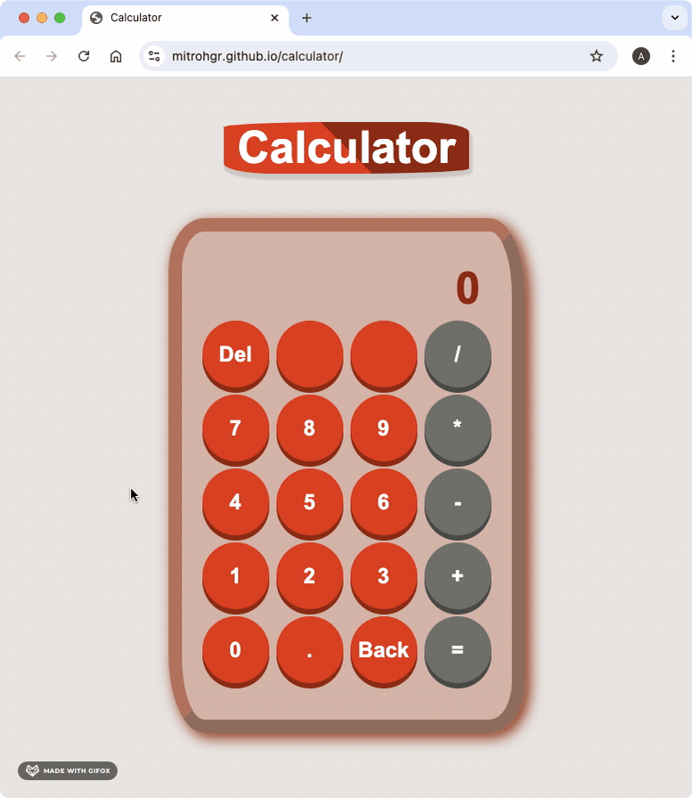
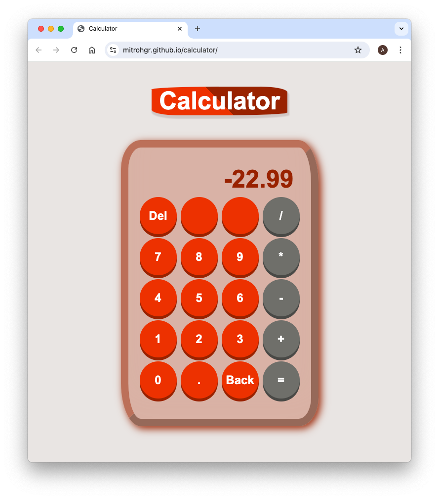

# calculator
An On-Screen Version of Calculator

## Demo

## Status

***This project will no longer be worked upon.***

This is because the [Learning to Code](https://dev.to/theodinproject/learning-code-f56) section of the [Becoming a TOP Success Story](https://dev.to/i3uckwheat/series/16683) makes it clear to [only focus on the point of the assignment](https://dev.to/theodinproject/learning-code-f56) and that [foundations isn't a strong portfolio generator](https://dev.to/theodinproject/learning-code-f56).

## General Info

**calculator** is the [last project](https://www.theodinproject.com/lessons/foundations-calculator) from the [Foundations Course](https://www.theodinproject.com/paths/foundations/courses/foundations) in [The Odin Project](https://www.theodinproject.com/about).

Here, I create an on-screen calculator with the following features:
+ ***Both Mouse and Keyboard Support*** are provided for the buttons on the screen.
+ ***All Basic Math Operations*** involving positive integers and floating-point numbers.
+ ***A Backspace Button*** to delete only single characters like a digit or a decmial point.
+ ***An Equals Key*** that evaluates and calculates one single pair of numbers at a time.
+ ***A Delete Key*** that wipes out any existing data so that the operation can be afresh.

## Screenshots

## Technologies

+ ***CLI***
+ ***Git***
+ ***GitHub***
+ ***HTML***
+ ***GitHub Pages***
+ ***CSS***
+ ***JavaScript***

## Self-reflections

> I learned quite a lot in this project: from object basics to completing the capstone project. So finally, this is end of the [Foundations Course](https://www.theodinproject.com/paths/foundations/courses/foundations). There are several phases to this project. The first phase involves getting all basic math operations working. This is quite easy. The second phase involves creating an HTML calculator with buttons for these operations along with an equals key and a clear key. This is easy as well. The third phase is when the calculator needs to work properly or at least close to that. I created a new branch for this and found it useful to work on the calculator logic separately.

> The last phase is when you add functionality for floating-point numbers, a backspace button and keyboard support. The biggest point is that the project specifications are clear in telling the developer to not think of operator precedence as they clearly mention to not evaluate more than one single pair of numbers at a time. Maybe at a later point in time, I will come back and add a whole bunch of features like operator precedence and several other scientific operations that are in a scientific calculator.

> [!NOTE]
> I have gotten into the habit of keeping developer tools open throughout the time I'm working on the project. This is quite helpful because I generally [use the rectangle window manager on mac](https://rectangleapp.com/) in order to have google chrome and my text editor side-by-side. In the browser, I change the dock position to bottom and always look for elements, styles, console, and sources pane whenever I'm unable to see either the div's changing color, the div opacity going up (or down), etc. Once more, debugging, developer tools combined with grit is the answer to calmly finish this project.

## Acknowledgements

+ *Credit* for the ***3D buttons*** goes to [Josh Comeau's tutorial](https://www.joshwcomeau.com/animation/3d-button/).
+ *Credit* for the ***README*** goes to [ritaly's README sheet](https://github.com/ritaly/README-cheatsheet).

## Contact and Support

+ Feel free to contact ***mitrohgr_03505*** on discord for project-related queries.
+ No further feature modifications or improvements will be done to this project.
